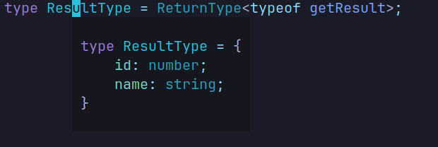
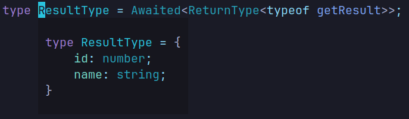
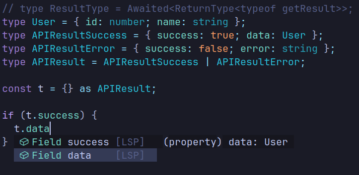
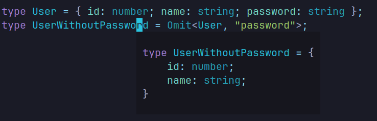
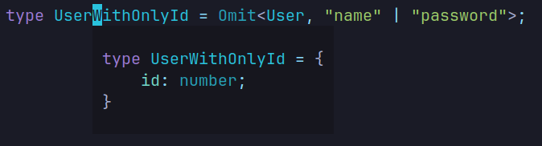
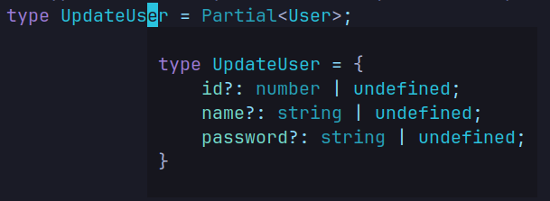
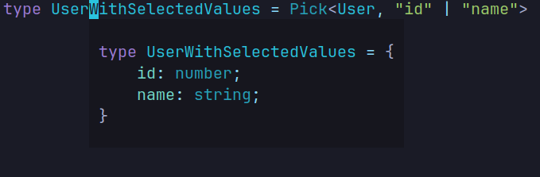
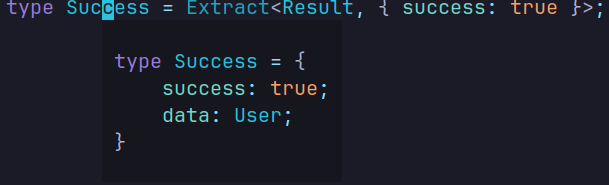
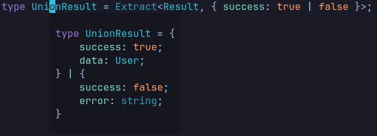

TypeScript has become a staple in web development, offering type safety and catching bugs during development. While it significantly enhances code reliability, it also introduces added complexity, which can make projects harder to manage.  

Fortunately, TypeScript comes with a wealth of built-in features—some of which are lesser-known yet incredibly useful. In this post, I’ll walk you through several of these features to make your TypeScript journey smoother and more efficient.  

---

Lets start:

## 1. ReturnType

We will keep this function simple
```ts
function getResult() {
  return {
    id: 1,
    name: "Shivang",
  };
}

type ResultType = ReturnType<typeof getResult>;
```
This will result in this:


---
## 2. Awaited
Ok, earlier one was easy right?, now we want to get the return type of async function, you will say there is no problem we just use the code from previous example. Yes, you can but... It will return a `Promise` not the resolved value of the promise. How can we do that?

```ts
async function getResult(){
  return {
    id: 1,
    name: "Shivang"
  }
}

type ResultType = Awaited<ReturnType<typeof getResult>>
```

This will result in this:


---

## 3. Union
Typescript supports union types, mean `if A then B if not A then C`

Lets see it with the help of example:

```ts
type User = {id: number; name: string};
type APIResultSuccess = {success: true, data: User};
type APIResultError = {success: false, error: string}
type APIResult = APIResultSuccess | APIResultError
const t = {} as APIResult;
if (t.success) {
  t.data // This exists
  t.error // This doesn't
}
else {
  t.data // Doesn't exists
  t.error // Exists
}
```
See how lsp only shows that only data can exist in that case


---


## 4. Omit
Sometime we need to omit specific properties from the object like: password or some other values which we don't want to expose to clients.
```ts
type User = { id: number; name: string; password: string };
type UserWithoutPassword = Omit<User, "password">;
```
This includes all the fields without password


### 4.1 Omit multiple properties
```ts
type UserWithOnlyId = Omit<User, "name" | "password">;
```
This includes all the fields except name, password. Same way you can exclude many parameters


---
## 5. Partial
This will make all properties optional which can come handy in situation like a patch request where we only want to update few columns/fields not all.
```ts
type UpdateUser = Partial<User>
```


---
## 6. Required
This will make all the properties required, inshort a opposite to partial.
```ts
type RequiredUser = Required<User>; 
// Wont do anything in our case because 
// we already have everthing marked with required.
```
---
## 7. Pick
This will pick specified value and contructs a new type with those values

```ts
type UserWithSelectedValues = Pick<User, "id" | "name">
```


---
## 8. Extract
This will extract all the types from union members that are assignable to union, lets see it in action.

Look into this api example, this comes very handy in server actions
```ts
type Result = {success: true, data: User} | {success: false, error: string};

// Now what if we want to extract data type only for success?
// We can use extract
type Success = Extract<Result, {success: true}>
```


#### 8.1 Union Extract
We can also provide it a union type to extract

```ts
type UnionResult = Extract<Result, {success: true | false}>
```


---

Ok guys that's a wrap up, you can read more about these utilities type from [typescript official docs](https://www.typescriptlang.org/docs/handbook/utility-types.html)
